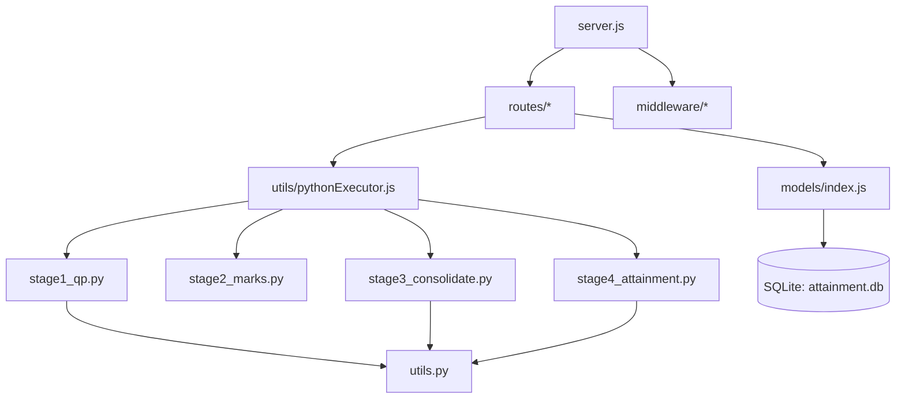
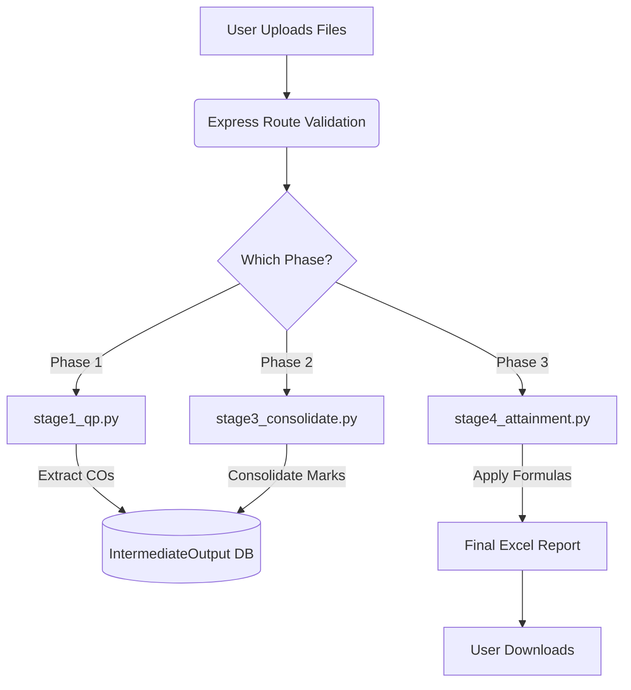

# Backend Architecture Audit & Cleanup Report

## 1. Executive Summary

- **Overall Backend Purpose**: The backend serves as an orchestration engine and API gateway for the CO (Course Outcome) Attainment Automation System. It manages user authentication, file uploads, state tracking, and coordinates complex Excel manipulation workflows.
- **Core Business Workflow**: Faculty upload student assessment data (CATs, Assignments, Terminal Exams). The backend triggers a sequence of Python scripts that parse these files, consolidate marks against a master template, calculate CO-wise percentages, apply attainment formulas based on threshold metrics (EP, ELA), and generate final Excel reports.
- **Main Backend Responsibilities**: 
  - API routing and request validation (Node.js/Express)
  - Database state management (SQLite via Sequelize ORM)
  - Inter-process communication to execute data-processing scripts (Python)
  - File system management for uploads and generated reports
- **Technologies Used**: 
  - **Node.js Environment**: Express.js, Sequelize ORM, Multer (file handling)
  - **Python Environment**: `openpyxl` (Excel manipulation), `pytesseract`/`Pillow` (OCR), `pandas`
  - **Database**: SQLite
- **Estimated Architectural Quality Score**: 6/10 
  - *Reasoning*: A clear separation of API (Node) and heavy lifting (Python) exists, which is good. However, the system suffers from "script-wrapper" syndrome where the Node backend is just passing files to Python scripts that contain hardcoded rules and paths.
- **Estimated Maintainability Score**: 5/10 
  - *Reasoning*: The Python scripts contain deeply hardcoded row/column indices and silent error handling. Legacy dead code (FastAPI artifacts) pollutes the workspace.

---

## 2. Backend Folder Tree

```text
backend/
├── .env                       # Active environment variables
├── .env.example               # Environment template
├── API_DOCUMENTATION.md       # API Spec (Actively used)
├── attainment.db              # SQLite Database (Actively used)
├── database.sql               # Legacy PostgreSQL schema [DEAD CODE]
├── package.json               # Node dependencies
├── README.md                  # Documentation
├── server.js                  # Main Express entry point (Actively used)
├── stage1_qp.py               # Python: Question Paper Parsing (Actively used)
├── stage2_marks.py            # Python: CAMU Marks Parsing (Actively used)
├── stage3_consolidate.py      # Python: Master Template Consolidation (Actively used)
├── stage4_attainment.py       # Python: CO Attainment Calculation (Actively used)
├── temp_ocr.png               # Leftover temporary file from OCR [UNUSED ASSET]
├── utils.py                   # Python helpers (Actively used)
├── colab code and their explanation.txt # Dev notes [DEAD CODE]
├── app/                       # Legacy FastAPI implementation [DEAD CODE]
│   └── (Contains __pycache__ for legacy python models, routers, services)
├── config/
│   └── database.js            # Sequelize configuration (Actively used)
├── middleware/
│   ├── auth.js                # JWT Authentication (Actively used)
│   ├── errorHandler.js        # Global error handlers (Actively used)
│   └── upload.js              # Multer configuration (Actively used)
├── models/                    # Sequelize ORM Models (Actively used)
│   ├── ActivityLog.js, Configuration.js, FacultyCourseAssignment.js, File.js
│   ├── IntermediateOutput.js, ProcessingLog.js, Report.js, Subject.js, User.js, index.js
├── routes/                    # Express API Routes (Actively used)
│   ├── admin.js, auth.js, configuration.js, phase1.js, phase2.js, phase3.js
│   ├── reports.js, subjects.js
└── utils/                     # Node Utilities
    ├── activityLogger.js      # DB logging (Actively used)
    ├── devSeed.js             # Dev seed script (Actively used)
    ├── fileManager.js         # Upload/output directory management (Actively used)
    ├── phaseTracker.js        # State transition logic (Actively used)
    └── pythonExecutor.js      # Node-to-Python bridge (Actively used)
```

---

## 3. Dependency Graph

### Text Dependency Graph
```text
server.js
 ├─> config/database.js
 ├─> middleware/auth.js, errorHandler.js
 ├─> utils/fileManager.js, devSeed.js
 └─> routes/* (auth, subjects, phase1, phase2, phase3, reports, admin)
      └─> models/index.js -> [All Sequelize Models]
      └─> utils/pythonExecutor.js
           ├─> stage1_qp.py -> utils.py
           ├─> stage2_marks.py
           ├─> stage3_consolidate.py -> utils.py
           └─> stage4_attainment.py -> utils.py
           Models --> DB[(SQLite: attainment.db)]
```

### Mermaid Dependency Diagram


---

## 4. Entry Points Analysis

| Entry Point | Location | Trigger Condition | Input | Output | Dependencies |
|---|---|---|---|---|---|
| **Express Server** | `server.js` | `npm start` | HTTP Requests | HTTP Responses | Express, Sequelize |
| **Phase 1 Upload** | `routes/phase1.js` | POST `/api/phase1/upload-qp` | Subject ID, DOCX/XLSX file | JSON (File record) | `models/File`, `multer` |
| **Stage 1 Exec** | `routes/phase1.js` | POST `/api/phase1/process` | Subject ID | JSON (Output paths) | `pythonExecutor.js` -> `stage1_qp.py` |
| **Stage 3 Exec** | `routes/phase2.js` | POST `/api/phase2/finalize` | Subject ID | JSON (Consolidated Excel) | `pythonExecutor.js` -> `stage3_consolidate.py` |
| **Stage 4 Exec** | `routes/phase3.js` | POST `/api/phase3/finalize` | Subject ID, terminal marks | JSON (Final Attainment Excel)| `pythonExecutor.js` -> `stage4_attainment.py` |

---

## 5. End-to-End Data Flow

### Narrative Explanation
1. **Setup**: Admin configures subjects and assigns faculty. Faculty set configuration (EP, ELA thresholds).
2. **Phase 1 (Preparation)**: Faculty uploads Question Papers (DOCX) or structured Excels. `stage1_qp.py` uses Tesseract OCR (if images exist) and text parsing to extract questions, max marks, and CO tags.
3. **Phase 2 (Continuous Assessment)**: Faculty uploads CAMU marks (CAT1, CAT2, ASS1, ASS2). `stage3_consolidate.py` merges these separate marks into a single Master Template Excel file. It aligns questions by normalized IDs and enforces assignment mark caps.
4. **Phase 3 (Terminal/End-Sem)**: Faculty uploads Terminal marks (CAMU format). `stage4_attainment.py` calculates internal vs terminal weighting (60/40), checks scores against the Expected Proficiency (EP) threshold, and computes relative attainment against the Expected Level of Attainment (ELA).
5. **Reporting**: The final `CO_ATTAINMENT_COMPLETE.xlsx` is generated, saved to `outputs/`, and logged in the database for download.

### Mermaid Flowchart


---

## 6. Business Logic Extraction

| Rule Description | File Location | Implementation Method | Risk if Modified |
|---|---|---|---|
| **Assignment Mark Cap** | `stage3_consolidate.py` (L158) | Auto-adjusts the final assignment column so the sum equals `target_total=40`. | **Critical**: Breaks academic evaluation constraints if assignment marks exceed 40. |
| **End-Sem Attainment Weight** | `stage4_attainment.py` (L398) | Formula: `=0.6*Internal + 0.4*Terminal` applied via openpyxl. | **Critical**: Directly impacts final student grades and accreditation metrics. |
| **Expected Proficiency (EP)** | `stage4_attainment.py` (L131) | Early intervention trigger. If student's internal average `< ep`, they are added to the Feedback sheet. | **Medium**: Modifying this will alter early-warning systems for struggling students. |
| **Relative Attainment (%)**| `stage4_attainment.py` (L449) | Formula: `=MIN((Actual/ELA)*100, 100)`. Capped at 100%. | **Critical**: Core metric for accreditation reporting. |
| **Question Normalization** | `utils.py` (L16) | Strips dots, whitespace, uppercase (e.g., "A.1" -> "A1"). | **High**: Changing this breaks merging between Question Papers and Marks files. |

---

## 7. Database Layer Analysis

- **System**: Uses SQLite (`attainment.db`) managed via **Sequelize ORM**.
- **Core Models**:
  - `User`, `Subject`, `FacultyCourseAssignment`: Access control and metadata.
  - `File`, `IntermediateOutput`, `Report`: Tracking uploaded and generated assets.
  - `Configuration`: Stores attainment thresholds (EP, ELA).
  - `ActivityLog`, `ProcessingLog`: Audit trails.
- **Cleanup**: `database.sql` is a legacy PostgreSQL schema and is completely unused. It should be deleted to prevent confusion.

---

## 8. API Layer Analysis

| Route | Method | Request Schema | Auth Req | Files Involved | Business Logic Invoked |
|---|---|---|---|---|---|
| `/api/phase1/process` | POST | `{ subject_id }` | Yes (JWT) | `stage1_qp.py` | Extracts Qs/Marks/COs from QP. |
| `/api/phase2/finalize`| POST | `{ subject_id }` | Yes (JWT) | `stage3_consolidate.py` | Incremental merging of CATs/ASSs. |
| `/api/phase3/finalize`| POST | `{ subject_id }` | Yes (JWT) | `stage4_attainment.py` | 60/40 weighting, Attainment %. |
| `/api/configuration/` | POST | `{ subject_id, ep, ela_co1... }`| Yes (JWT) | `models/Configuration.js` | Saves EP/ELA thresholds to DB. |

---

## 9. Services Layer Analysis

- The Node backend does not have a distinct "Services" folder (logic is mixed in route controllers).
- **Service Simulation**: `utils/pythonExecutor.js` acts as an inter-process service.
  - **Responsibility**: Spawns Python processes with arguments, handles timeouts (default 5 mins), captures stdout/stderr.
  - **Refactoring Opportunity**: `app/services/` exists as `__pycache__` dead code. True Node services should be created (e.g., `AttainmentService.js`) to abstract the `pythonExecutor` calls out of the route controllers.

---

## 10. Utility Layer Analysis

| Utility | Functions Provided | Callers | Reusability | Recommendation |
|---|---|---|---|---|
| `pythonExecutor.js` | `runStage1`, `runStage2`, `runStage3`, `runStage4` | Phase Routes | High | Keep. Add better timeout error handling. |
| `fileManager.js` | `ensureDir`, `deleteFile` | `server.js`, Routes | High | Keep. |
| `utils.py` | `normalize_question_id`, `clean_numeric`, `get_column_letter` | Python Stages | High | Keep, but remove `get_column_letter` as openpyxl has `get_column_letter` built-in. |

---

## 11. File Usage Matrix

| File | Imported By | Uses | Critical? | Class |
|---|---|---|---|---|
| `server.js` | (Entry) | Express, DB, Routes | Yes | Core |
| `stage3_consolidate.py`| `pythonExecutor.js` | openpyxl, `utils.py` | Yes | Core |
| `stage4_attainment.py` | `pythonExecutor.js` | openpyxl, `utils.py` | Yes | Core |
| `utils.py` | Python Stages | pandas, openpyxl | Yes | Supporting |
| `database.sql` | None | None | No | **Dead** |
| `app/` (folder) | None | None | No | **Dead** |
| `temp_ocr.png` | `stage1_qp.py` | None | No | **Dead/Bug** |
| `colab code...txt` | None | None | No | **Dead** |

---

## 12. Dead Code Detection

| Item | Type | Confidence | Justification |
|---|---|---|---|
| `database.sql` | File | **High** | Sequelize+SQLite is actively used. |
| `app/` folder | Folder | **High** | Contains only `__pycache__` for a legacy FastAPI app. Completely bypassed by Node.js. |
| `colab code and their explanation.txt` | File | **High** | Developer scratchpad notes. |
| `temp_ocr.png` | File | **High** | Leftover artifact from `stage1_qp.py` due to a swallowed exception during cleanup. |

---

## 13. Duplicate Logic Detection

- **Duplicate Built-ins**: `utils.py` implements a custom `get_column_letter` function, but it imports `from openpyxl.utils import get_column_letter` in other scripts.
- **Redundant Orchestration**: `routes/phase2.js` and `routes/phase3.js` share massive chunks of identical DB lookup logic (fetching Subject, verifying course assignment).
  - *Recommendation*: Extract a shared `SubjectValidationService` middleware/utility in Node.

---

## 14. Hardcoded Values Audit

| Item | File | Line | Recommended Approach |
|---|---|---|---|
| Temporary Image Path | `stage1_qp.py` | 84 | Use Python's `tempfile.NamedTemporaryFile()` to prevent concurrency conflicts during simultaneous uploads. |
| Target Total (40) | `stage3_consolidate.py` | 158 | Pass as an argument from the database `Configuration` table. |
| Template Paths | `stage3_consolidate.py` | 172 | Pass absolute path dynamically from Node environment variables. |
| Excel Column CB (80) | `stage4_attainment.py` | 309 | Find columns dynamically via header names instead of hardcoding `80`. |
| 60/40 Weighting | `stage4_attainment.py` | 398 | Store in DB `Configuration` and pass as JSON arguments. |

---

## 15. Error Handling Audit

| Issue | Severity | Description |
|---|---|---|
| **Silent Cleanup Failure** | **High** | `stage1_qp.py` line 94: `except Exception: pass` around `Path(temp_path).unlink()`. If pytesseract fails, the temp file locks and is never deleted. |
| **Concurrency Crash** | **High** | Hardcoding `"temp_ocr.png"` guarantees a race condition if two users upload papers simultaneously. |
| **Orphaned File Pointers** | **Medium** | Node routes delete files via `deleteFile()` on DB failure, but if the Node process crashes mid-route, files stay in `uploads/` forever. |

---

## 16. Security Audit

- **Path Traversal Risk**: Low. `multer` stores files with generated UUIDs/timestamps, mitigating traversal.
- **Input Validation**: `stage4_attainment.py` runs `eval()`-like injection risks if `phase` or `output_path` are constructed unsafely, but `pythonExecutor.js` JSON-serializes inputs.
- **Environment Variables**: `.env` is committed to the repository (based on folder tree). **High Risk**. `.env` should be in `.gitignore`.

---

## 17. Performance Audit

- **Redundant Excel Loading**: `stage4_attainment.py` calls `load_workbook` with `data_only=False` and later loads the terminal path with `data_only=True`. Large excel sheets will consume significant RAM (~100MB+ per execution).
- **Synchronous OCR**: `stage1_qp.py` loops over images synchronously. pytesseract is slow.
  - *Recommendation*: Limit max pages/images or queue these jobs via a background worker (e.g., BullMQ) instead of blocking the Express HTTP response.

---

## 18. Technical Debt Report

| Priority | Description | Impact | Effort | Recommendation |
|---|---|---|---|---|
| **1 (Must Fix)** | Concurrency issue in `stage1_qp.py` (hardcoded `temp_ocr.png`). | Prevents multi-user scaling. | Low | Use `tempfile.NamedTemporaryFile(delete=False)`. |
| **1 (Must Fix)** | `.env` tracked in source control. | Security breach risk. | Low | Add to `.gitignore`, remove from git index. |
| **2 (Should Fix)**| Hardcoded Excel columns in Stage 3/4. | Breaks if template changes. | Medium | Implement header-search logic (like `find_value_after_keyword`). |
| **2 (Should Fix)**| Extracted DB logic from routes. | Code duplication. | Medium | Create `SubjectService.js` to handle DB checks. |
| **3 (Nice To Fix)**| `app/` and `database.sql` dead code. | Developer confusion. | Low | Delete immediately. |

---

## 19. Backend Cleanup Plan

- **Phase 1 (Immediate - Safe to delete)**:
  - Delete `app/` directory completely.
  - Delete `database.sql`.
  - Delete `colab code and their explanation.txt`.
  - Delete `temp_ocr.png`.
- **Phase 2 (Refactoring)**:
  - Update `stage1_qp.py` to use `tempfile`.
  - Remove custom `get_column_letter` in `utils.py` and replace with `from openpyxl.utils import get_column_letter`.
- **Phase 3 (Architecture)**:
  - Move hardcoded academic rules (40 marks cap, 60/40 weighting) into the `Configuration` DB table so admins can tweak them without touching Python code.

---

## 20. Backend Knowledge Transfer Summary

**Welcome to the backend!** 
Here is what you absolutely must know to survive:

1. **What it really does**: We run a Node.js server purely to host an API and handle SQLite state. The actual brain of the system is the Python scripts in the root directory. Node saves an uploaded Excel file, passes the file path to Python via `child_process.spawn()`, Python does the math, saves a new Excel file, and Node sends that file to the user.
2. **Critical files to understand first**: `utils/pythonExecutor.js` (how Node talks to Python) and `stage4_attainment.py` (the core grading formulas).
3. **Files you can ignore/delete**: The entire `app/` folder, `database.sql`. They are ghosts of a past architecture.
4. **Most dangerous files**: `stage3_consolidate.py` and `stage4_attainment.py`. They rely on exact cell references (e.g., "column 80"). If the frontend provides an Excel sheet formatted differently, these scripts will crash or silently corrupt grades.
5. **Never break**: The 40-mark assignment cap in `stage3_consolidate.py` and the 60/40 weighting in `stage4_attainment.py`. These represent strict academic policies.
6. **Next steps**: Spend your first week fixing the `temp_ocr.png` concurrency bug in `stage1_qp.py` and cleaning out the dead files mentioned in Phase 1 of the cleanup plan.
